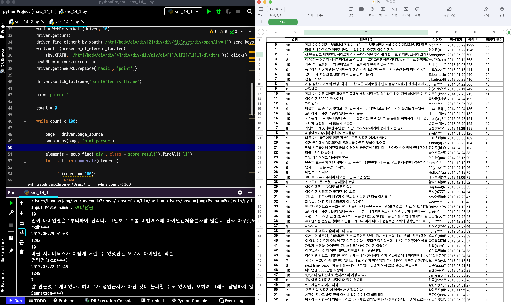
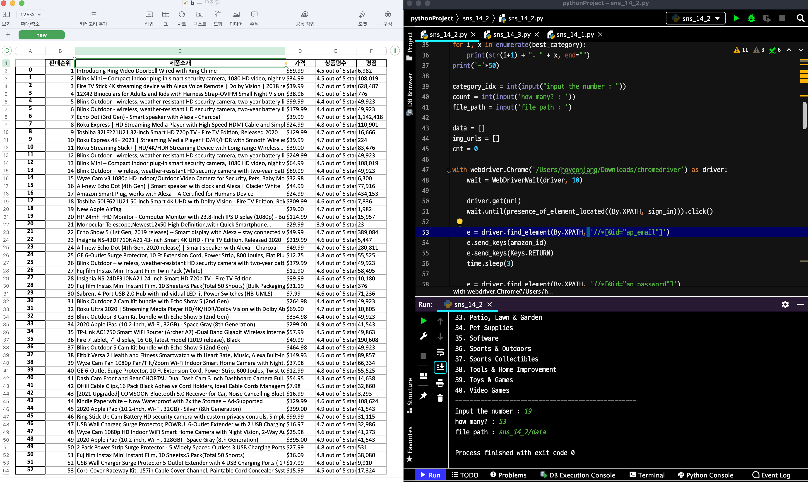

# sns_14_assignment

### ISSUE

엑셀에 상품 이미지 추가 불가.  

     - https://xlsxwriter.readthedocs.io/bugs.html -
     
    *Images not displayed correctly in Excel 2001 for Mac and non-Excel applications*
    
    Images inserted into worksheets via insert_image() may not display correctly in Excel 2011 for Mac and non-Excel applications such as OpenOffice and    LibreOffice. 
    Specifically the images may looked stretched or squashed. 
    This is not specifically an XlsxWriter issue. It also occurs with files created in Excel 2007 and Excel 2010.

    <h3>1</h3>
    

 
 

    <h3>2</h3>
    

 
 

    <h3>3</h3>
    

